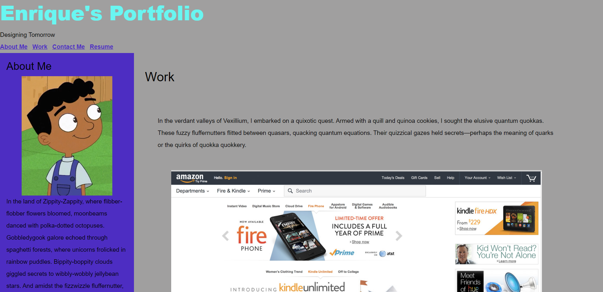

# Nexafolio

## Description
Created an example of a portfolio that contains information about me, my work experience, images of the work I have done. The website contains my contact informations and images that take you to the links of my projects.
## Acceptance Criteria
GIVEN I need to sample a potential employee's previous work
WHEN I load their portfolio
THEN I am presented with the developer's name, a recent photo or avatar, and links to sections about them, their work, and how to contact them
WHEN I click one of the links in the navigation
THEN the UI scrolls to the corresponding section
WHEN I click on the link to the section about their work
THEN the UI scrolls to a section with titled images of the developer's applications
WHEN I am presented with the developer's first application
THEN that application's image should be larger in size than the others
WHEN I click on the images of the applications
THEN I am taken to that deployed application
WHEN I resize the page or view the site on various screens and devices
THEN I am presented with a responsive layout that adapts to my viewport
## Installation
N/A
## Usage
My portfolio is used for companies to view information about me to better understand my abilities as a computer programer. To know how and where to contact me from, and to help them determine whether I am a good candidate for the job.
## License
N/A

